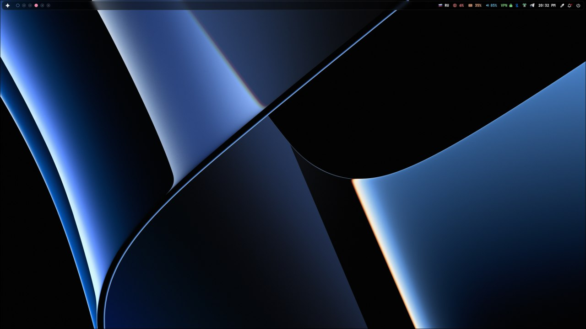

# ⚙️ dotfiles



> [!CAUTION]
> ⚠️ This setup is specific for [Hyprland](https://github.com/hyprwm/Hyprland). Dont install it if you don't know what you're doing.

---

## 📋 Overview

This repository provides an automated setup script (`install.sh`) to bootstrap a complete Arch Linux desktop environment with [Hyprland], open-source NVIDIA drivers, Wayland ecosystem, fonts, localization, Bluetooth, audio, AUR helper, and a curated set of desktop applications.

The script is intended for **fresh installations** and will make significant changes to your system.
**Read and review the script before running.**

---

## ✨ Features

- 🖥️ Full Hyprland Wayland compositor stack
- 🎮 Open-source NVIDIA driver configuration (with kernel and initramfs tweaks)
- 🔧 Essential utilities, fonts, and locale setup (Russian by default)
- 📡 Bluetooth, audio (Pipewire), and popular desktop apps
- 📦 Automated AUR helper (`yay`) installation and AUR packages
- 🐚 Zsh shell configuration with plugins and Oh My Zsh
- 🔧 Node.js, Bun, Zed editor setup
- 🎨 GTK themes, icons, and wallpapers
- 📁 Copies all dotfiles and configs from the repo to your home directory
- 🔄 Final system reboot

---

## 📋 Prerequisites

- 🐧 Clean Arch Linux installation
- 👤 Superuser (sudo) privileges
- 🌐 Internet connection

---

## 🚀 How to Use

1. **📥 Clone the repository:**
```
git clone https://github.com/haxgun/dotfiles.git
cd dotfiles
```

> [!IMPORTANT] 
2. **👀 Review the script:**
Open `install.sh` in your editor and ensure you understand the operations.

3. **🔐 Make the script executable:**
```
chmod +x install.sh
```

4. **▶️ Run the script:**
```
./install.sh
```

> [!WARNING]
> This will update your system, install and configure drivers, desktop environment, and user applications.
> The script will also reboot your machine at the end.

---

## 🔧 What the Script Does

- **🏗️ System Base Setup:** Updates system, installs core utilities, and enables NetworkManager.
- **🎮 NVIDIA Drivers:** Installs open-source NVIDIA drivers, configures kernel parameters, and updates initramfs.
- **🖥️ Hyprland & Graphics:** Installs Hyprland compositor and essential Wayland packages. Handles errors gracefully.
- **🌊 Wayland Essentials:** Installs Vulkan, seatd, and configures seatd.
- **🔤 Fonts & Locale:** Installs popular fonts, sets Russian locale.
- **📡 Bluetooth & Audio:** Installs and enables Bluetooth, Pipewire, and audio utilities.
- **📦 AUR Helper:** Installs `yay` if missing.
- **🏪 AUR Packages:** Installs browsers, fonts, themes, and other utilities from AUR.
- **🖥️ Desktop Apps:** Installs file manager, password manager, browser, and more.
- **🐚 Shell Setup:** Installs Zsh, Oh My Zsh, and useful plugins.
- **💻 Development Tools:** Installs Node.js, Bun, Zed editor.
- **🎨 Themes & Icons:** Sets up GTK themes, icons, and wallpaper.
- **📁 Dotfiles:** Copies all configuration files from the repo.
- **🔄 Final Reboot:** Reboots system to apply all changes.

---

## 📝 Notes

- 🌍 The script sets the system locale to `ru_RU.UTF-8`. Change this if you prefer another language.
- 🎮 NVIDIA DRM modeset and modules are configured for optimal Wayland/NVIDIA support.
- 📁 All dotfiles and configs in `.config` will be copied to your home directory.
- 👤 The script assumes you are running it as your regular user with `sudo` access.
- 🖥️ Additional desktop apps (like Beekeeper Studio, OBS Studio) are installed at the end.

---

## 🔧 Troubleshooting

- ❌ If Hyprland or any package fails to install, the script will output the error log and exit.
- 🎮 For NVIDIA-specific issues, ensure your hardware is compatible with the open drivers.
- ✏️ If you need to customize which apps or themes are installed, edit `install.sh` before running.

---

**🎉 Enjoy your new Hyprland-powered Arch Linux desktop!**
